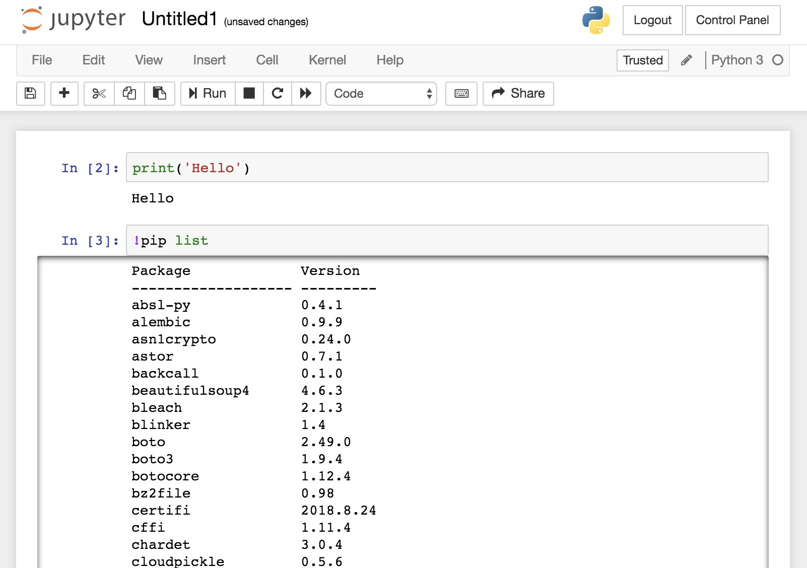

# How to Use Git in Experimentor

## Open a terminal in Experimentor

1. Sign in [ExperimentorX](https://experimentorx.mentoracademy.org) with your Coursera account.

2. Click "New" -> "Terminal" to open the terminal

    
    


## Clone the Git Repo
<!-- add git repo url -->
1. Clone the project in <NEED A REPO URL>

2. Run `git config --global user.email "you@examle.com"` and `git config --global user.name "Your Name"` in Experimentor's terminal to config your Github account

3. Make sure all team members are added as the collaborators of the repo on Github

## Make changes in Experimentor

1. Click on the logo of "Jupyter" to go back to the home view, enter the folder of the repo you just cloned

2. Create a notebook file by clicking "New" -> "Python3"
    
    

    
    
## Sync changes

1. Open Experimentor's terminal, commit the changes and push it to Github

2. Ask other teammates to pull the changes from Experimentor's terminal

## Install Python Packages in Experimentor

- There are some common packages installed in Experimentor. To check them, open a notebook and type the following:

    

- If the package you need is not on this list, you could install by typing:

    ```
    !pip install __packageX__
    ```

## What if the notebook is not working?

Since Experimentor is still a research prototype, it might run into issues. If the Python code in your notebook is not working, please try to restart the kernel. If it doesn't work out, or you experience other issues, please contact April via Slack or email.